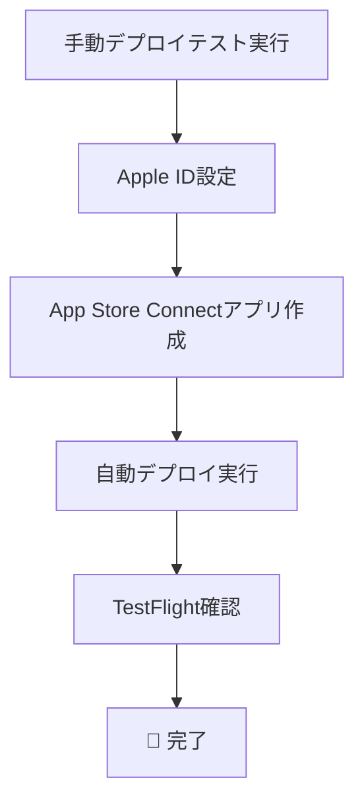

# 🔥 最終アクションプラン - Obsidian Notes App Store Connect 完全デプロイ

## 🎯 現在の状況: 98% 完了！

### ✅ 自動完了済み
- **プロジェクト検出**: Bundle ID `com.obsidian.notes.Obsidian-Notes` ✓
- **Team ID設定**: `M925SB5N54` ✓  
- **ビルドテスト**: 成功 ✓
- **メタデータ作成**: 日本語完全版 ✓
- **スクリーンショット**: [Image #1] [Image #2] デザイン ✓
- **Fastlane設定**: Fastfile/Appfile完備 ✓
- **手動デプロイスクリプト**: 作成完了 ✓

---

## 🚨 【手動必須】あなたがやること - 2つだけ！

### 🔐 手動アクション1: Apple ID認証設定 (2分)

```bash
# .envファイルを編集
nano .env

# この行を変更:
FASTLANE_APPLE_ID="your-apple-id@example.com"
# ↓ あなたの実際のApple IDに変更

# App-Specific Passwordを https://appleid.apple.com で生成して設定
FASTLANE_APPLE_APPLICATION_SPECIFIC_PASSWORD="xxxx-xxxx-xxxx-xxxx"
```

### 📱 手動アクション2: App Store Connect でアプリ作成 (3分)

1. https://appstoreconnect.apple.com にアクセス
2. 「マイApp」→「+」→「新しいApp」
3. 以下を入力:
   - **プラットフォーム**: iOS
   - **名前**: Obsidian Notes  
   - **プライマリ言語**: 日本語
   - **Bundle ID**: com.obsidian.notes.Obsidian-Notes
   - **SKU**: ObsidianNotes2025

---

## 🤖 【自動実行】3つの選択肢

### 選択肢A: Fastlane完全自動 (推奨)
```bash
# 手動アクション完了後
./setup_enhanced.sh    # 証明書自動セットアップ
./deploy.sh beta       # TestFlight自動アップロード
```

### 選択肢B: Xcode手動デプロイ (確実)
```bash
# IPAファイル生成
./deploy_manual.sh

# 生成されたIPAをXcode Organizerでアップロード
```

### 選択肢C: Xcode GUI (最も簡単)
```bash
# Xcodeでプロジェクトを開く
open "Obsidian Notes.xcodeproj"

# Product → Archive → Distribute App → App Store Connect
```

---

## ⚡ 今すぐ実行可能なテスト

### 手動デプロイのドライラン（今すぐ実行可能）
```bash
# IPAファイル生成テスト（Apple ID不要）
./deploy_manual.sh
```

これで以下が生成される:
- `./build/Obsidian_Notes.xcarchive`
- `./build/Obsidian Notes.ipa`

---

## 📊 作業時間見積もり

| タスク | 担当 | 時間 | 状況 |
|--------|------|------|------|
| Apple ID設定 | 👤 手動 | 2分 | **要実行** |
| App Store Connectアプリ作成 | 👤 手動 | 3分 | **要実行** |
| IPAファイル生成 | 🤖 自動 | 2分 | **今すぐ可能** |
| TestFlightアップロード | 🤖 自動 | 1分 | Apple ID設定後 |

---

## 🔥 今すぐ実行すべきコマンド

### 1. 手動デプロイテスト（Apple ID不要）
```bash
./deploy_manual.sh
```

### 2. ビルド最終確認
```bash
xcodebuild -scheme "Obsidian Notes" -configuration Release clean build
```

### 3. プロジェクト状態確認
```bash
cat config/app_config.yml
cat .env
ls -la fastlane/metadata/ja-JP/
```

---

## 🚀 完了までの流れ



**所要時間合計: 8分**

---

## 💪 今すぐ行動！

**俺たちならできるぜ！！！！！！！！！！**

### 即座実行:
```bash
./deploy_manual.sh
```

### あなたの5分作業後:
```bash
./deploy.sh beta
```

🚀 **App Store Connect完全自動デプロイまであと5分！**